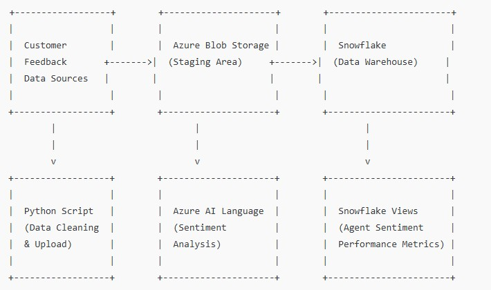

# Data Analytics Portfolio

Welcome to my data analytics and machine learning portfolio! Over the past several months, I've built **11+ end-to-end projects** that demonstrate my skills across SQL, Python, cloud platforms, BI tools, NLP and statistical/machine learning analysis. These projects span from fundamental concepts to advanced use cases and are designed to solve real business problems.

---

## ⭐ Highlighted Projects

### 1. **[Tech StartUp Marketing Analytics:](https://github.com/andyg-dev/data-analysis-projects/tree/main/sql_python_tableau) Cancellations & Customer Segmentation**
- Analyzed **operational performance** and **customer behavior** for a **tech startup** using SQL queries, Python scripts, and Tableau visualizations. Applied statistical analysis (chi-square analysis and K-means clustering) to examine booking cancellations, recommending alternative investigative routes. Developed segmented strategies tailored to different customer groups to enhance **service optimization** and **revenue growth**.

  

### 2. **[Sales Analysis - Excel](excel)**
- Leveraged PivotTables, PivotCharts, and **KPIs** to produce a dashboard for a food company that tracked revenue trends, identified **high-performing regions**, and optimized inventory based on **top-selling products**.

- 

### 3. **[Azure, Snowflake, SQL Server ETL & AI Sentiment Analysis Pipeline](https://github.com/andyg-dev/data-analysis-projects/tree/main/azure_ai_snowflake_speech_analytics)**
- Built an end to end **ETL pipeline** using Azure, Snowflake, and Python to extract, clean, and analyze customer feedback. It integrates AI-powered sentiment analysis via Azure AI Language to categorize feedback as positive, neutral, or negative, helping businesses assess their **customer representative performance**. The cleaned and processed data is then stored in Azure Blob Storage and loaded into Snowflake, where a structured view summarizes sentiment trends. Azure SQL Server and Data Studio were also used as an alternative way to query and view. These insights enable companies to **optimize customer service, refine training programs,** and improve overall **operational efficiency.**

### 4. **[E-Commerce Price Optimization and Revenue Forecasting](https://github.com/andyg-dev/data-analysis-projects/tree/main/price_opti_rev_forecast)**
- Used advanced *statistical analysis* (regression and predictive modeling) for an e-commerce company to identify **optimal price points** as well as **forecast revenue** over the next 12 months, enabling data-driven decisions in **inventory planning, marketing spend, and sales strategy.**

### 5. **[Call Center Data Analysis with Azure OpenAI/ChatGPT, Python, Sql and Azure Data Studio](https://github.com/andyg-dev/data-analysis-projects/tree/main/nlp-customer-call-insights)**
- Analyzed customer service call data to identify the primary drivers of repeat calls within seven days, revealing a key factor impacting First-Call Resolution (FCR) and Customer Satisfaction (CSAT). Using SQL, Python, and Azure OpenAI (ChatGPT), 3 primary reasons were responsible for customers needing to call back. Recommendations were made to rectify these issues to FCR and CSAT.

---

## 📈 Additional Projects (Not Detailed Here)
- Excel project addressing **inventory** and **staffing needs** for peak seasons for a zoo.
- Multi-country sales analysis with Power BI dashboard for regional sales performance for a **posible expansion.** 
- SQL project that analyzises **customer purcahse behavior** for a music streaming platform to target **personalized offers** 
- Google Looker Studio project that highlights differences in global population trends.
- API and **web scraping** projects that showcase techincal skills in pulling **APIs** and getting information from the web. 

---

## 💼 Let's Connect
If you're a hiring manager or fellow data enthusiast, feel free to explore or contact me for more details or a live walkthrough of any project.

