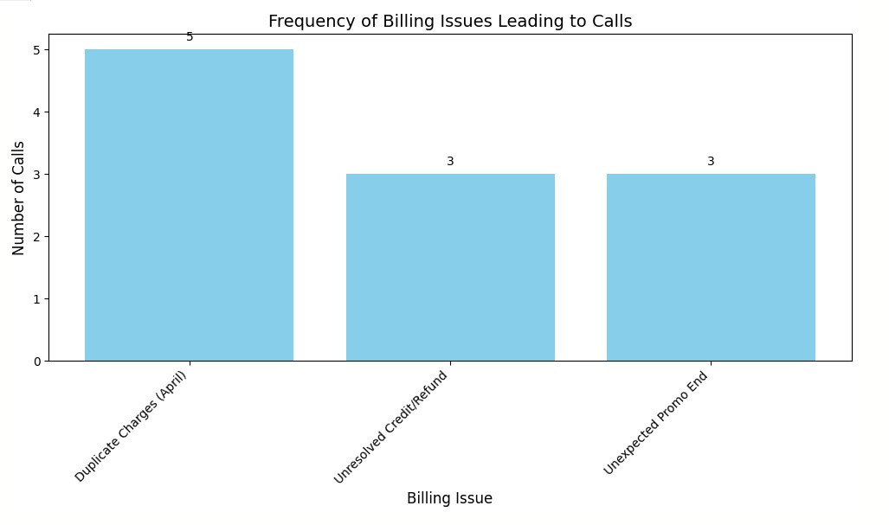

# Analysis of Customer Service Call Drivers: Identifying Repeat Call Issues

**Prepared For:** Leadership of Customer Operations Team of ConnectPoint Analytics

**Prepared By:** Andy Green

**Skills Utilized:** Azure Data Studio, SQL, Python, Azure OpenAI (ChatGPT), Azure, Natural Language Processing, Relational Databases, Azure Copilot

## Executive Summary

This report addresses the critical business question: **Which customer-reported issues most often trigger a repeat call within 7 days, negatively impacting First-Call Resolution (FCR) and Customer Satisfaction (CSAT)?**

By carefully examining simulated customer service call data, I've identified the main reasons why customers need to contact us multiple times shortly after their initial call, specifically related to billing. My findings show that **incorrectly charging customers twice for April, failing to promptly resolve promised credits or refunds, and unclear communication about when promotional discounts end are the biggest drivers of these repeat calls.**

Fixing these issues is important because it will help us improve our First-Call Resolution (FCR) – the rate at which we solve customer problems on their very first call. A higher FCR usually means happier customers (better CSAT) because they get their issues resolved quickly and efficiently.

## Business Question Addressed

Which customer-reported issues most often trigger a repeat call within 7 days, driving down First-Call Resolution (FCR) and CSAT?

## How I Analyzed the Data

To answer this, I used a few key steps and tools:

1.  **Getting the Data (SQL & Azure Data Studio):** I used SQL in Azure Data Studio to pull the necessary information from our customer call records (which are stored in organized databases).
2.  **Finding Repeat Issues (SQL):** I used more SQL to identify which initial call reasons led to customers calling back within a week.
3.  **Understanding the Details (Azure OpenAI & Python):** I then used Azure OpenAI (specifically ChatGPT), along with Python, to read and understand the actual words customers used during these calls. This helped me figure out the exact problems they were facing and why they might need to call back. **Azure Copilot also helped in troubleshooting some of the technical parts of using Python to connect to Azure OpenAI.**
4.  **Seeing the Big Picture (Python):** Finally, I used Python to create a simple chart that visually shows which billing issues happened most frequently.

## What I Found

My analysis highlighted the following main reasons for customers calling back about billing issues within 7 days:

1.  **Double Billing in April:** Many customers were charged twice for their service in April, leading to confusion and the need to call us.
2.  **Unresolved Promises of Credits or Refunds:** When customers were overcharged (like with the double billing), agents often promised a credit or refund. However, if these weren't applied quickly, customers had to call back to follow up.
3.  **Surprise End of Promotions:** Customers were often caught off guard when their promotional discounts ended, causing their bills to suddenly increase. This lack of clear communication led to them contacting us for explanations.

*The chart above shows how often each of these billing problems led to customers calling us.*

## Why This Matters for Our Business

When customers have to call us multiple times for the same issue, it hurts two important things:

* **First-Call Resolution (FCR):** This is a measure of how often we solve a customer's problem on their very first call. Repeat calls lower this score, meaning we're not being as efficient as we could be.
* **Customer Satisfaction (CSAT):** Customers get frustrated when they have to call us repeatedly. This makes them less satisfied with our service.

## My Recommendations

To reduce these repeat calls and improve customer experience, I recommend the following:

1.  **Fix the April Double Billing Problem:** We need to figure out why this happened and make sure it doesn't happen again. We also need to make sure all affected customers get their bills corrected quickly.
2.  **Improve How We Handle Credits and Refunds:** When we promise a customer a credit or refund, we need to make sure it's processed quickly and that the customer knows it has been done.
3.  **Communicate Clearly About Promotions:** We need to make it very clear to customers when they sign up for a promotion and when it will end. We should also remind them before the promotion ends to avoid surprises on their bill.
4.  **Train Our Teams on Billing Issues:** We should ensure our customer service teams are well-trained to handle common billing questions on the first call and to properly follow up on promises made to customers.

## In Conclusion

By focusing on fixing these key billing issues, we can reduce the number of times customers need to call us, improve how efficiently we solve their problems on the first try, and ultimately make our customers happier with our service. Taking action on these recommendations will lead to a better experience for everyone.
